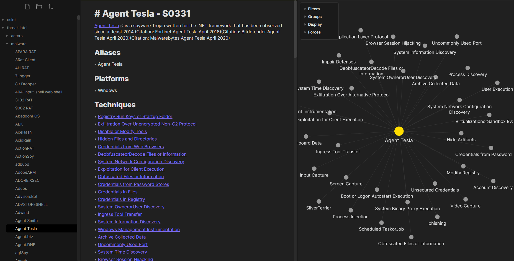

## CTI Documentation Maker
This is a rough but functional set of scripts to take data from multiple sources and create comprehensive markdown documentation, intended for use with Obsidian. It has been heavily inspired by [pyattck](https://github.com/swimlane/pyattck), but I wanted something more lightweight. In short: actors backlink to malware and tools, malware and tools backlink to techniques, and techniques contain emulations and backlink to mitigations. Sub-techniques are detailed under their parent. This format should serve as a solid foundation upon which you can build out your personal documentation.

**Note:** This is a PoC that was written over a couple of afternoons. In time I'll tidy it up so that classes are used for each data type and it's more easily extensible.

### Categories
- Actors  
- Malware  
- Mitigations  
- Sources  
- Techniques  
- Tools  

### Sources
- [MISP Galaxies](https://github.com/MISP/misp-galaxy)  
- [Thai ETDA](https://apt.etda.or.th/cgi-bin/aptgroups.cgi)  
- [Atomic Red Team](https://github.com/redcanaryco/atomic-red-team)  
- [deepdarkCTI](https://github.com/fastfire/deepdarkCTI)  

### Sample



### Operation
Run in order:
```
python3 -m pip install pyyaml
./make_folders.sh
./update_data.sh
./build.py
```